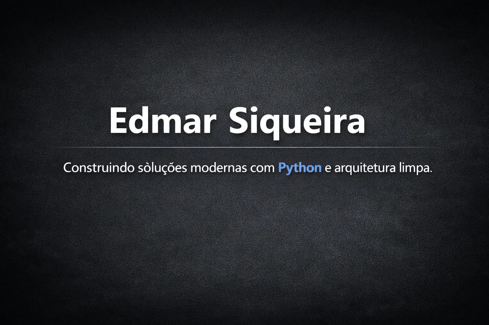

# 📌 Portfólio – Edmar Siqueira

Portfólio profissional desenvolvido com **Flask**, **TailwindCSS**, arquitetura modular e SEO dinâmico.  
Inclui páginas de projetos carregadas via JSON, conteúdo técnico separado, layout premium e estrutura escalável.

---

## 🚀 Tecnologias Utilizadas

- **Python 3.12+**
- **Flask + Blueprints**
- **Jinja2**
- **TailwindCSS (CDN)**
- **JavaScript**
- **HTML5**
- **CSS3**
- **Docker** (opcional)
- **PostgreSQL** (para projetos internos)

---

## 🧩 Estrutura do Projeto

```text
app/
 ├── routes/                 # Blueprints e rotas
 │    ├── home.py
 │    ├── projects.py        # Rota dinâmica /projects/<slug>
 │    └── contact.py
 ├── templates/
 │    ├── components/        # Cards, grids, partials
 │    ├── projects/          # Conteúdo técnico dos projetos
 │    ├── project_detail.html# Página dinâmica de projeto
 │    ├── projects.html      # Lista de projetos
 │    ├── contact.html
 │    ├── home.html
 │    └── base.html          # SEO + layout global
 ├── static/
 │    ├── img/
 │    ├── css/
 │    └── js/
 ├── data/
 │    └── projects.json      # Banco de dados dos projetos
 └── __init__.py             # Factory pattern
 ```

# 🖥️ Projetos em Destaque

## 🔹 Alpha Bot Trading – US500
Robô profissional para MetaTrader 5 com:
* **Arquitetura SRP**
* **Estratégias em camadas**
* **IA com XGBoost**
* **Auditoria completa em PostgreSQL**
* **API com FastAPI**

## 🔹 Notebook Manager – Konecta
Sistema interno para:
* **Gestão de notebooks corporativos**
* **Auditoria de movimentações**
* **Governança e conformidade**
* **API com FastAPI + PostgreSQL**

## 📦 Como rodar o projeto
1.  **Clone o repositório**
```bash
git clone https://github.com/SEU_USUARIO/edmar-portfolio.git
cd edmar-portfolio
```

2) Crie o ambiente virtual
```bash
python -m venv .venv
source .venv/bin/activate   # Linux/Mac
.venv\Scripts\activate      # Windows
```
3) Instale as dependências
```bash
 pip install -r requirements.txt
```

4) Execute o servidor Flask
```bash
flask run
```
## 🐞 Modo Debug (sem variáveis de ambiente)
```bash
flask run --debug
✔ Ativa debug
✔ Ativa reload automático
✔ Ativa debugger interativo
✔ Simples e direto
```
## 🌐 Deploy
Em breve:
* **Render**
* **Railway**
* **Fly.io**
* **Docker (Dockerfile + compose)**
* **GitHub Actions para CI/CD**

## 🔍 SEO Implementado

O projeto inclui:

- `<title>` dinâmico por página  
- `<meta description>` dinâmica  
- OpenGraph (WhatsApp, LinkedIn, Facebook)  
- Twitter Cards  
- Preview image (`/static/img/preview.png`)  
- SEO por projeto usando `project_detail.html`  

---

## 🗺️ Roadmap

- [ ] Dark/Light Mode com toggle e persistência  
- [ ] Melhorar animações da Home  
- [ ] Criar página de Serviços  
- [ ] Criar formulário de contato funcional  
- [ ] Versão em inglês  
- [ ] Deploy em produção  
- [ ] Adicionar testes automatizados  
- [ ] Criar painel admin para gerenciar projetos  

---

## 📄 Licença

Este projeto está sob a licença **MIT**.  
Sinta-se livre para usar como referência.

---

## ✨ Autor

**Edmar Siqueira**  
Desenvolvedor Python & Automação  

📧 **edmar.ade@gmail.com**  
🔗 **LinkedIn:** https://www.linkedin.com/in/edmarsiqueira/
